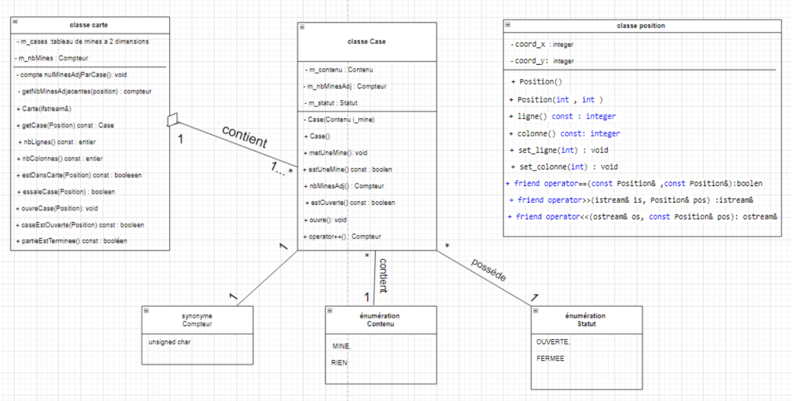

# Position Class

## Methods

### Position()
- **Access**: Public
- **Type**: Default Constructor
- **Description**: Initializes a Position object with default coordinates (0, 0).
- **Inputs**: None
- **Outputs**: An initialized Position object.
- **Preconditions**: None
- **Postconditions**: `coord_x = 0`, `coord_y = 0`

### Position(int x, int y)
- **Access**: Public
- **Type**: Parameterized Constructor
- **Description**: Initializes a Position object with user-defined coordinates.
- **Inputs**:
  - `x` (int): The value of the x-coordinate.
  - `y` (int): The value of the y-coordinate.
- **Outputs**: An initialized Position object.
- **Preconditions**: The values of `x` and `y` must be valid (typically integers).
- **Postconditions**: `coord_x = x`, `coord_y = y`

### int ligne() const
- **Access**: Public
- **Type**: Getter
- **Description**: Returns the value of the x-coordinate of the position.
- **Inputs**: None
- **Outputs**: The x-coordinate (type int).
- **Preconditions**: The Position object must be initialized.
- **Postconditions**: Returns the current value of `coord_x` without modifying it.

### int colonne() const
- **Access**: Public
- **Type**: Getter
- **Description**: Returns the value of the y-coordinate of the position.
- **Inputs**: None
- **Outputs**: The y-coordinate (type int).
- **Preconditions**: The Position object must be initialized.
- **Postconditions**: Returns the current value of `coord_y` without modifying it.

### void set_ligne(int ligne)
- **Access**: Public
- **Type**: Setter
- **Description**: Modifies the value of the x-coordinate of the position.
- **Inputs**:
  - `ligne` (int): The new value of the x-coordinate.
- **Outputs**: None
- **Preconditions**: The Position object must be initialized.
- **Postconditions**: The value of `coord_x` is updated with the value of `ligne`.

### void set_colonne(int colonne)
- **Access**: Public
- **Type**: Setter
- **Description**: Modifies the value of the y-coordinate of the position.
- **Inputs**:
  - `colonne` (int): The new value of the y-coordinate.
- **Outputs**: None
- **Preconditions**: The Position object must be initialized.
- **Postconditions**: The value of `coord_y` is updated with the value of `colonne`.

### bool operator==(const Position& pos1, const Position& pos2)
- **Access**: Global Function (Operator Overload)
- **Type**: Equality Operator
- **Description**: Checks if two Position objects are equal.
- **Inputs**:
  - `pos1` (Position): The first position to compare.
  - `pos2` (Position): The second position to compare.
- **Outputs**: `true` if both positions are identical, `false` otherwise.
- **Preconditions**: The objects `pos1` and `pos2` must be initialized.
- **Postconditions**: Returns `true` if `pos1.coord_x == pos2.coord_x` and `pos1.coord_y == pos2.coord_y`, otherwise returns `false`.

### istream& operator>>(istream& is, Position& pos)
- **Access**: Global Function (Operator Overload)
- **Type**: Extraction Operator (>>)
- **Description**: Allows input of the coordinates of a Position object from an input stream (like `cin`).
- **Inputs**:
  - `is` (istream): The input stream from which data is read.
  - `pos` (Position): The Position object to be updated.
- **Outputs**: The updated input stream.
- **Preconditions**: The stream `is` must be valid and open. The input values must be two valid integers.
- **Postconditions**: The values of `coord_x` and `coord_y` are updated with the values read from the stream. In case of input error (non-integer values), the user will be prompted to re-enter.

## Attributes
| No. | Access & Type | Name      | Description                      |
|-----|---------------|-----------|----------------------------------|
| 1   | Private: int  | coord_x   | Receives the row number          |
| 2   | Private: int  | coord_y   | Indicates a column in the position of

## UML

## OUTPUT
### Sample 1

### Sample 1

